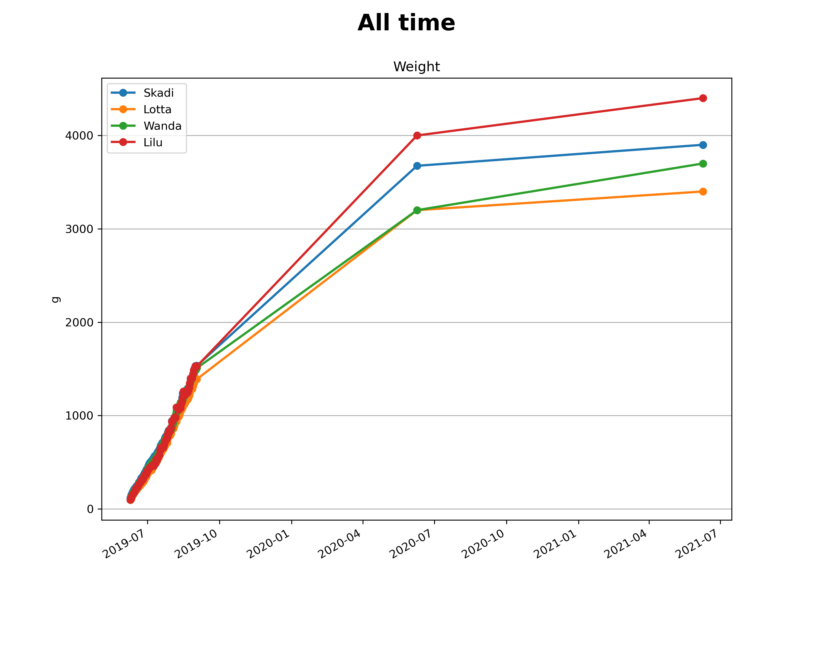

# fatcat - Kalis kitten's weight analysis

## The Story

During early spring 2019 our young cat Kali started behaving strange and was gaining weight quickly.
The dialog at our vet by that time could be summarized as follows:

Vet: Well, the cat is pregnant.

We: But she is castrated!

Vet: Really? That's rare, but happens, if not done properly. Who did the surgery?

We: It was done here...

Vet: ...

So, a few weeks later in the heat of summer 2019, four cute kittens were given birth by Kali.

## The Data

Since you should weigh young kittens regularly to check their health and I really love big-fat data,
I decided to keep the weights of each kitten in a .csv file and analyze and plot it using
python, pandas and matplotlib. Since this started as a private-only repository, you will find
some German commit messages among the early commits - sorry!

Also note, that it was not possible to weight every kitten every day.
I interpolated those days manually, but unfortunately not marked it in the raw data. Sorry for that as well.

The new owners of the cats are asked to weigh the now grown up cats once per year
around their birthday. 
Those yearly-based data points have to be considered much more inaccurate for the following reasons:

* The weighting in the early weeks was done by us on a precise digital kitchen scale.
  Now the new owners seem use bathroom scales with a much lower resolution (~100g) and
  low accuracy around such low weights. Those scales are build for human weighting.
* The four kittens now live with three different owners - each using their own scale with
  unknown precision.

## The Analysis

### First month

### First three months

### All time

